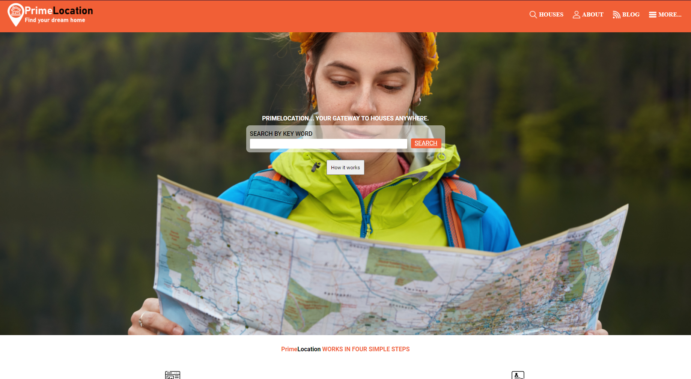

# PrimeLocation captone project.

> This is the capstone project for the html & CSS module, which is based on a directory of schools.

<!-- Additional description about the project and its features. -->

## Built With

- HTML
- CSS

## Live Demo

[Live Demo Link](https://luisvinicius09.github.io/capstone-one/)

## Getting Started

**This is an example of how you may give instructions on setting up your project locally.**
**Modify this file to match your project, remove sections that don't apply. For example: delete the testing section if the currect project doesn't require testing.**

To get a local copy up and running follow these simple example steps.

### Prerequisites

Text editor.
Browser.

### Install

Donwload the node_modules folder.
`npm install`

### Usage

Open the index file on a browser.

### Run tests

Run LightHouse
`npx hint .`

Run StyleLint
`npx stylelint "**/*.{css,scss}"`

## Authors

👤 **Luis Vinicius**

- GitHub: [@luisvinicius09](https://github.com/luisvinicius09)
- Twitter: [@luisvinicius09](https://twitter.com/twitterhandle)
- LinkedIn: [LinkedIn](https://linkedin.com/in/luis-vinicius)

## 🤝 Contributing

Contributions, issues, and feature requests are welcome!

Feel free to check the [issues page](https://github.com/luisvinicius09/capstone-one/issues).

## Show your support

Give a ⭐️ if you like this project!
